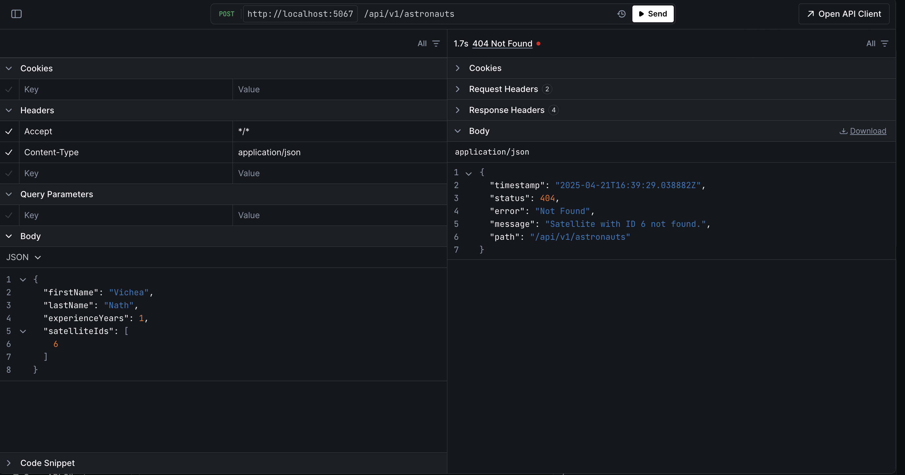
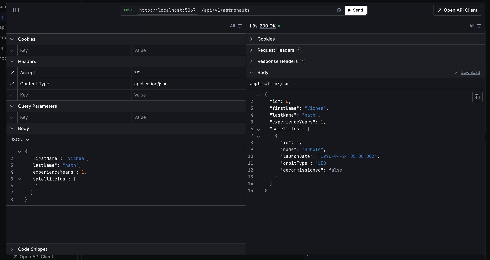
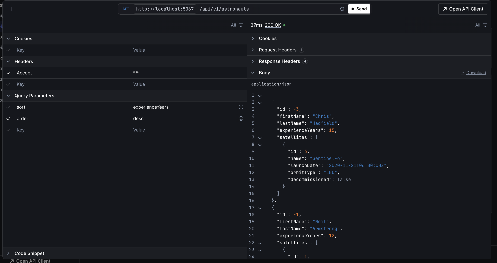
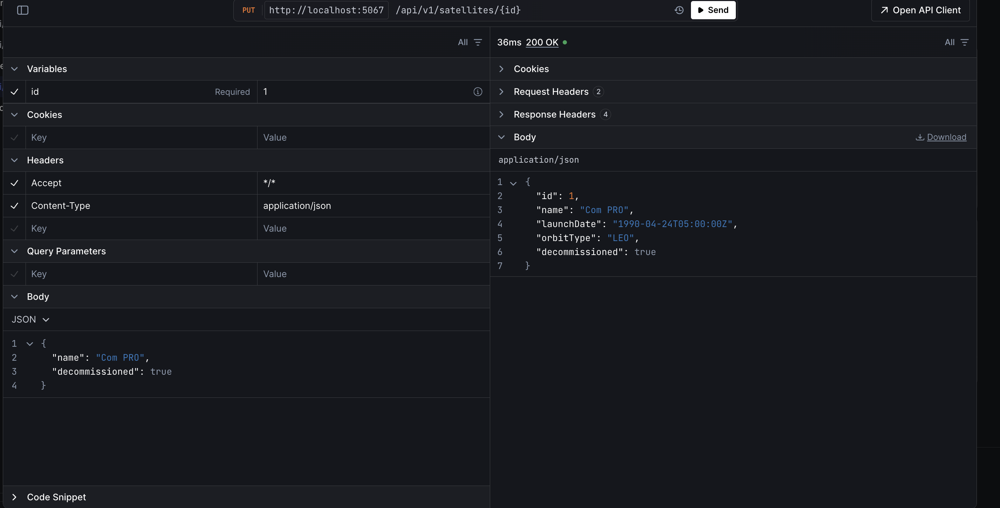

# Screenshots

Below are the screenshots of the application:

## API Exception Handling

## API Create Astronaut

## API Get Astronauts with asc and desc

## API Get Update Satellites

<!-- Add more screenshots as needed -->

---

## Implementation Details

- **Domain model design**: Implemented in the `Models` folder.
- **DTO structure**: Implemented in the `DTOs` folder.
- **Service layer**: Implemented in the `Services` folder.
- **Controller layer**: Implemented in the `Controllers` folder.
- **Global Exception Handling**: Implemented in the `Filters` folder.
- **Database Context and Migrations**: Implemented in the `Data` and `Migrations` folders.
